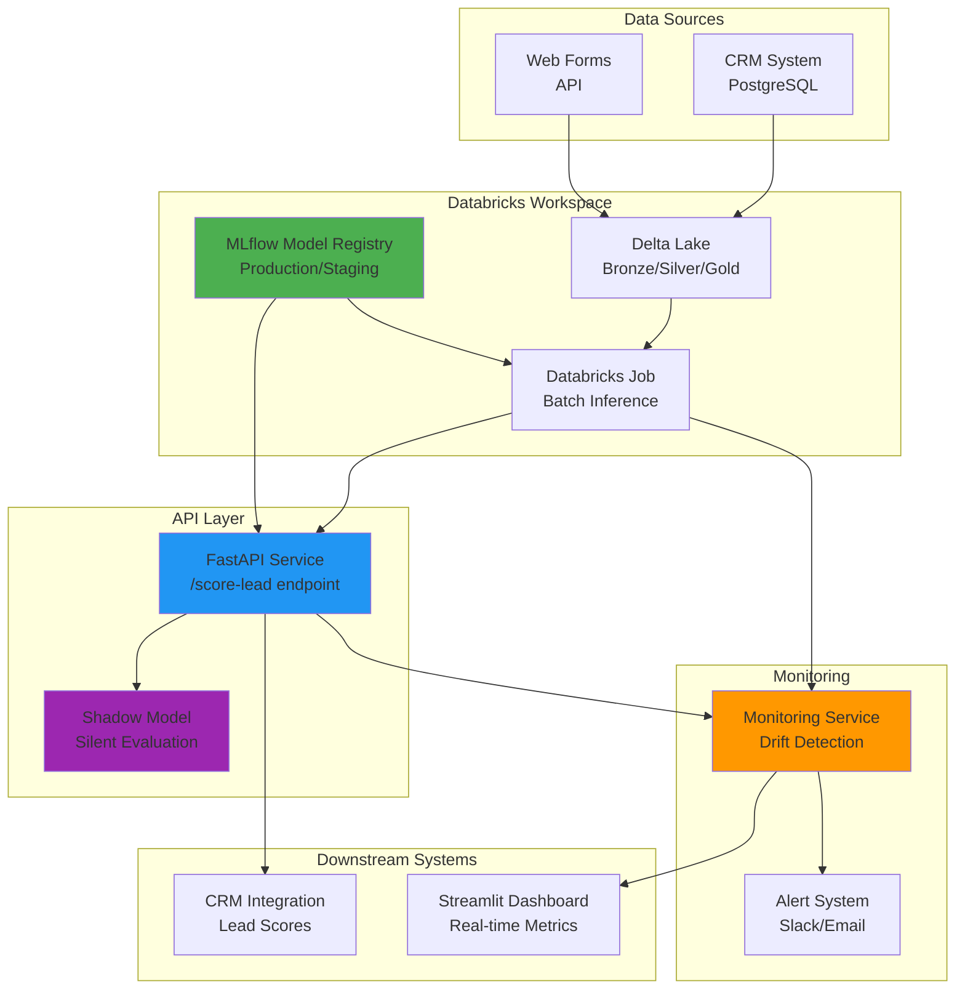

# Deployment Architecture

## Overview
This document describes the end-to-end deployment architecture for the RAKEZ Lead Scoring Model.

## Mermaid Diagram

## Architecture Components

### 1. Data Sources
- **CRM System (PostgreSQL)**: Stores lead information, contact details, interaction history
- **Web Forms/API**: Real-time lead submissions from marketing campaigns

### 2. Databricks Workspace
- **Delta Lake**: Medallion architecture (Bronze → Silver → Gold)
  - Bronze: Raw ingested data
  - Silver: Cleaned, validated data
  - Gold: Feature-engineered datasets for ML
- **MLflow Model Registry**: 
  - Production: Current live model
  - Staging: Candidate models for promotion
  - Archived: Previous model versions
- **Databricks Jobs**: Scheduled batch inference runs

### 3. API Layer
- **FastAPI Service**: RESTful API for real-time scoring
  - Endpoint: `/score-lead`
  - Loads model from MLflow registry
  - Input validation and error handling
- **Shadow Model**: Parallel evaluation of new models without affecting production

### 4. Monitoring System
- **Drift Detection**: Continuous monitoring of data and model drift
- **Alert System**: Slack/Email notifications for anomalies
- **Metrics Logging**: Latency, throughput, conversion rates

### 5. Downstream Systems
- **CRM Integration**: Pushes lead scores back to CRM for sales team
- **Streamlit Dashboard**: Real-time visualization of model performance

## Data Flow

1. **Ingestion**: Leads flow from CRM and web forms into Delta Lake
2. **Feature Engineering**: Databricks notebooks transform raw data into ML features
3. **Model Inference**: 
   - Batch: Scheduled Databricks jobs process historical leads
   - Real-time: FastAPI serves on-demand scoring requests
4. **Monitoring**: All predictions logged and monitored for drift
5. **Integration**: Scores pushed to CRM and visualized in dashboard

## Deployment Strategy

- **Canary Deployment**: Gradual rollout of new models
- **Shadow Mode**: New models evaluated in parallel
- **Rollback Mechanism**: Quick reversion to previous model version
- **A/B Testing**: Split traffic between model versions

