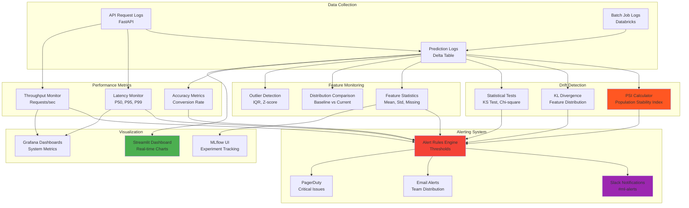

# Monitoring Architecture

## Overview
Comprehensive monitoring system for model performance, data quality, and system health.

## Mermaid Diagram

## Monitoring Components

### 1. Data Collection
- **API Request Logs**: All FastAPI requests logged with timestamps, inputs, outputs
- **Batch Job Logs**: Databricks job execution logs, processing times, record counts
- **Prediction Logs**: Centralized Delta table storing all predictions with metadata

### 2. Drift Detection
- **PSI (Population Stability Index)**: 
  - Threshold: PSI > 0.25 indicates significant drift
  - Calculated per feature and overall
- **KL Divergence**: Measures distribution shift between baseline and current data
- **Statistical Tests**: 
  - Kolmogorov-Smirnov test for continuous features
  - Chi-square test for categorical features

### 3. Performance Metrics
- **Latency Monitoring**: 
  - P50, P95, P99 percentiles
  - Target: P95 < 200ms
- **Throughput**: Requests per second capacity
- **Accuracy Metrics**: 
  - Conversion rate (leads → customers)
  - Precision/Recall for lead scoring
  - Business KPIs: Revenue per lead

### 4. Feature Monitoring
- **Feature Statistics**: 
  - Mean, standard deviation, min, max
  - Missing value percentage
  - Cardinality for categorical features
- **Distribution Comparison**: Baseline vs current distributions
- **Outlier Detection**: IQR method, Z-score analysis

### 5. Alerting System
- **Alert Rules**: 
  - PSI > 0.25: Warning
  - PSI > 0.5: Critical
  - Latency P95 > 500ms: Warning
  - Error rate > 1%: Critical
- **Notification Channels**: 
  - Slack: #ml-alerts channel
  - Email: ML team distribution list
  - PagerDuty: Critical production issues

### 6. Visualization
- **Streamlit Dashboard**: Real-time monitoring with interactive charts
- **Grafana**: System-level metrics (CPU, memory, network)
- **MLflow UI**: Experiment tracking and model versioning

## Monitoring Schedule

- **Real-time**: API latency, throughput, error rates
- **Hourly**: Feature statistics, distribution checks
- **Daily**: PSI calculation, KL divergence, accuracy metrics
- **Weekly**: Comprehensive drift report, model performance review

## Alert Escalation

1. **Level 1 (Info)**: Logged to dashboard, no notification
2. **Level 2 (Warning)**: Slack notification to #ml-alerts
3. **Level 3 (Critical)**: Email + Slack + PagerDuty alert

