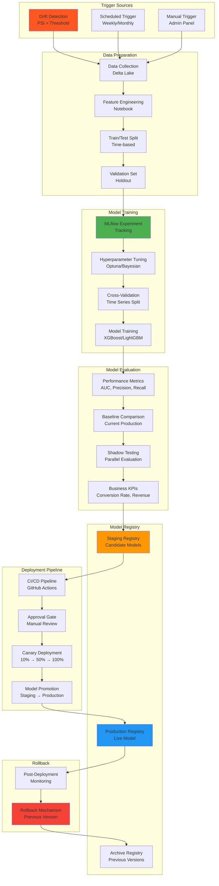

# Retraining Architecture

## Overview
Automated model retraining pipeline triggered by drift detection or scheduled intervals.

## Mermaid Diagram

## Retraining Workflow

### 1. Trigger Sources
- **Drift Detection**: Automatic trigger when PSI > 0.25 or significant distribution shift detected
- **Scheduled Trigger**: Weekly or monthly retraining regardless of drift
- **Manual Trigger**: Admin-initiated retraining for special cases

### 2. Data Preparation
- **Data Collection**: 
  - Latest 6 months of labeled data from Delta Lake
  - Ensures sufficient sample size (minimum 10,000 records)
- **Feature Engineering**: 
  - Reapplies same transformations as production
  - Handles missing values, encoding, scaling
- **Train/Test Split**: 
  - Time-based split (80/20)
  - Prevents data leakage
- **Validation Set**: 
  - Holdout set for final evaluation
  - Represents most recent data

### 3. Model Training
- **MLflow Experiment Tracking**: 
  - Logs all hyperparameters, metrics, artifacts
  - Enables experiment comparison
- **Hyperparameter Tuning**: 
  - Optuna or Bayesian optimization
  - 50-100 trials per experiment
- **Cross-Validation**: 
  - Time series cross-validation
  - Respects temporal ordering
- **Model Training**: 
  - XGBoost or LightGBM
  - Early stopping to prevent overfitting

### 4. Model Evaluation
- **Performance Metrics**: 
  - AUC-ROC (primary metric)
  - Precision, Recall, F1-score
  - Calibration metrics (Brier score)
- **Baseline Comparison**: 
  - Must outperform current production model
  - Minimum improvement: +2% AUC or +5% business KPI
- **Shadow Testing**: 
  - Deploy to shadow mode for 1-2 weeks
  - Compare predictions with production
- **Business KPIs**: 
  - Conversion rate improvement
  - Revenue per lead increase
  - Sales team feedback

### 5. Model Registry
- **Staging Registry**: 
  - Candidate models awaiting approval
  - Tagged with experiment ID and metrics
- **Production Registry**: 
  - Current live model
  - Only one production model at a time
- **Archive Registry**: 
  - Previous model versions
  - Maintained for rollback capability

### 6. Deployment Pipeline
- **CI/CD Pipeline**: 
  - Automated testing (unit, integration)
  - Model validation checks
  - Databricks job deployment
- **Approval Gate**: 
  - Manual review by ML lead
  - Business stakeholder sign-off
- **Canary Deployment**: 
  - Phase 1: 10% traffic (1 day)
  - Phase 2: 50% traffic (2 days)
  - Phase 3: 100% traffic
- **Model Promotion**: 
  - Automatic promotion after successful canary
  - Updates MLflow registry tags

### 7. Rollback Mechanism
- **Automatic Rollback Triggers**: 
  - Error rate > 2%
  - Latency degradation > 50%
  - Business KPI drop > 10%
- **Manual Rollback**: 
  - One-click rollback to previous version
  - Maintains model registry history
- **Post-Deployment Monitoring**: 
  - Intensive monitoring for 48 hours
  - Daily performance reports

## Retraining Schedule

- **Drift-Triggered**: As needed (typically monthly)
- **Scheduled**: Weekly for first 3 months, then monthly
- **Emergency**: Manual trigger for critical issues

## Model Versioning

- **Version Format**: `v{MAJOR}.{MINOR}.{PATCH}`
  - MAJOR: Breaking changes, new features
  - MINOR: Performance improvements
  - PATCH: Bug fixes, minor updates
- **Metadata Stored**: 
  - Training date, data range, metrics
  - Feature list, hyperparameters
  - Model artifacts, dependencies

