# 🎨 RAKEZ Lead Scoring - Complete Architecture Diagrams

This document contains all visual architecture diagrams for the RAKEZ Lead Scoring Model deployment and monitoring system.

---

## 📑 Table of Contents

1. [System Overview](#1-system-overview)
2. [Deployment Architecture](#2-deployment-architecture)
3. [Monitoring Architecture](#3-monitoring-architecture)
4. [Retraining Architecture](#4-retraining-architecture)
5. [API Request Flow (Sequence)](#5-api-request-flow-sequence)
6. [Data Flow (Medallion Architecture)](#6-data-flow-medallion-architecture)
7. [CI/CD Pipeline](#7-cicd-pipeline)
8. [Model Lifecycle](#8-model-lifecycle)
9. [Component Interaction](#9-component-interaction)

---

## 1. System Overview

### High-Level Architecture

---

## 2. Deployment Architecture

### Complete Deployment Flow

**Key Components:**
- **MLflow Registry**: Manages model versions (Production, Staging, Archived)
- **FastAPI**: Real-time scoring API with < 200ms latency target
- **Shadow Model**: Parallel evaluation without affecting production
- **Delta Lake**: Medallion architecture for data versioning

---

## 3. Monitoring Architecture

### Comprehensive Monitoring System

**Monitoring Schedule:**
- **Real-time**: API latency, throughput, error rates
- **Hourly**: Feature statistics, distribution checks
- **Daily**: PSI calculation, KL divergence, accuracy metrics
- **Weekly**: Comprehensive drift report

---

## 4. Retraining Architecture

### Automated Retraining Pipeline

**Retraining Triggers:**
- **Drift-Triggered**: PSI > 0.25 or significant distribution shift
- **Scheduled**: Weekly (first 3 months), then monthly
- **Business Metrics**: Conversion rate drop > 10%
- **Manual**: Admin-initiated for special cases

---

## 5. API Request Flow (Sequence)

### Real-time Scoring Request Flow

**Key Features:**
- **Input Validation**: Pydantic models ensure data quality
- **Shadow Model**: Parallel evaluation without affecting production
- **Logging**: All predictions logged to Delta Lake for audit
- **Monitoring**: Real-time metrics update

---

## 6. Data Flow (Medallion Architecture)

### Delta Lake Medallion Architecture

**Data Quality Gates:**
- **Bronze**: Schema validation, timestamp tracking
- **Silver**: Data cleaning, deduplication, null handling
- **Gold**: Feature engineering, aggregations, transformations

---

## 7. CI/CD Pipeline

### Complete CI/CD Workflow

```mermaid
flowchart TD
    START([Code Push / PR]) --> LINT{Lint & Test}
    
    LINT -->|Fail| FAIL1[❌ Fail Build]
    LINT -->|Pass| VALIDATE{Validate Notebooks}
    
    VALIDATE -->|Fail| FAIL2[❌ Fail Build]
    VALIDATE -->|Pass| BRANCH{Branch?}
    
    BRANCH -->|develop| STAGING[Deploy to Staging]
    BRANCH -->|main| PROD_CHECK{Production<br/>Approval?}
    
    STAGING --> STAGING_TEST[Run Tests]
    STAGING_TEST --> STAGING_DEPLOY[Deploy to Databricks<br/>Staging]
    
    PROD_CHECK -->|Approved| PROD_DEPLOY[Deploy to Production]
    PROD_CHECK -->|Rejected| REJECT[❌ Deployment Blocked]
    
    PROD_DEPLOY --> VALIDATE_MODEL[Validate MLflow Model]
    VALIDATE_MODEL --> CANARY_10[Canary: 10% Traffic<br/>1 Day]
    
    CANARY_10 --> CHECK_10{Metrics OK?}
    CHECK_10 -->|No| ROLLBACK1[🔄 Rollback]
    CHECK_10 -->|Yes| CANARY_50[Canary: 50% Traffic<br/>2 Days]
    
    CANARY_50 --> CHECK_50{Metrics OK?}
    CHECK_50 -->|No| ROLLBACK2[🔄 Rollback]
    CHECK_50 -->|Yes| CANARY_100[Canary: 100% Traffic]
    
    CANARY_100 --> CHECK_100{Metrics OK?}
    CHECK_100 -->|No| ROLLBACK3[🔄 Rollback]
    CHECK_100 -->|Yes| SUCCESS[✅ Production Deployed]
    
    SUCCESS --> MONITOR[Monitor 48 Hours]
    ROLLBACK1 --> ARCHIVE[Archive Failed Version]
    ROLLBACK2 --> ARCHIVE
    ROLLBACK3 --> ARCHIVE
    
    style START fill:#E3F2FD
    style SUCCESS fill:#4CAF50
    style FAIL1 fill:#F44336
    style FAIL2 fill:#F44336
    style ROLLBACK1 fill:#FF9800
    style ROLLBACK2 fill:#FF9800
    style ROLLBACK3 fill:#FF9800
```

**Pipeline Stages:**
1. **Lint & Test**: Code quality, unit tests
2. **Validate**: Notebook syntax, model validation
3. **Deploy Staging**: Auto-deploy on develop branch
4. **Deploy Production**: Manual approval + canary deployment
5. **Canary Phases**: 10% → 50% → 100% with monitoring
6. **Rollback**: Automatic on failure

---

## 8. Model Lifecycle

### Model Version Lifecycle State Diagram

**State Transitions:**
- **Development → Staging**: Model meets performance criteria
- **Staging → Shadow**: Approved for shadow testing
- **Shadow → Canary**: Shadow metrics acceptable
- **Canary → Production**: Gradual rollout successful
- **Any → Archived**: Failure or replacement

---

## 9. Component Interaction

### System Component Interaction Diagram

**Interaction Patterns:**
- **Synchronous**: API → Model → Response
- **Asynchronous**: Model → Logging → Monitoring
- **Caching**: Feature Store → Redis → Model
- **Event-Driven**: Metrics → Drift Detection → Alerts

---

## 📊 Diagram Usage Guide

### When to Use Each Diagram

| Diagram | Use Case | Audience |
|---------|----------|----------|
| **System Overview** | High-level presentation, executive summary | Executives, Stakeholders |
| **Deployment Architecture** | Technical implementation details | Engineers, Architects |
| **Monitoring Architecture** | Operations and monitoring setup | DevOps, ML Engineers |
| **Retraining Architecture** | Model lifecycle management | ML Engineers, Data Scientists |
| **API Request Flow** | API integration and debugging | Developers, Integration Teams |
| **Data Flow** | Data pipeline understanding | Data Engineers, Analysts |
| **CI/CD Pipeline** | Deployment process | DevOps, Release Managers |
| **Model Lifecycle** | Model versioning strategy | ML Engineers, Product Managers |
| **Component Interaction** | System design and architecture | Architects, Senior Engineers |

---

## 🔗 Related Documentation

- **Detailed Architecture**: `01_architecture/deployment_architecture.md`
- **Monitoring Details**: `01_architecture/monitoring_architecture.md`
- **Retraining Details**: `01_architecture/retraining_architecture.md`
- **Presentation**: `06_docs/presentation_slides.md`
- **Complete Guide**: `06_docs/detailed_readme.md`
- **Diagram Index**: `06_docs/DIAGRAM_INDEX.md`

---

## 📝 Notes

- All diagrams use **Mermaid** syntax and render in:
  - GitHub/GitLab markdown viewers
  - VS Code with Mermaid extension
  - Online: https://mermaid.live/
  - Documentation tools (MkDocs, Docusaurus, etc.)

- For **PowerPoint/PDF** conversion:
  - Use Mermaid Live Editor to export as PNG/SVG
  - Or use tools like `mermaid-cli` for batch conversion

---

**Last Updated**: 2025-01-05  
**Version**: 2.0  
**Maintained By**: ML Engineering Team

